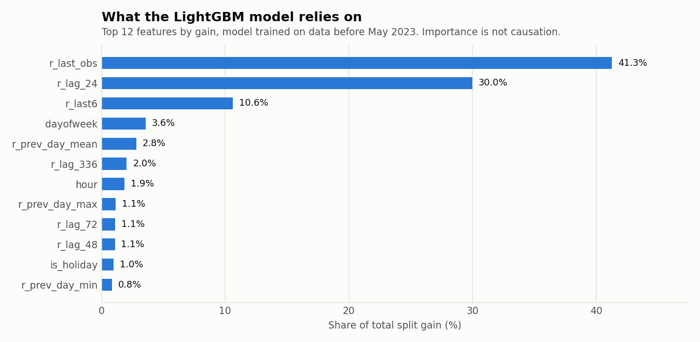
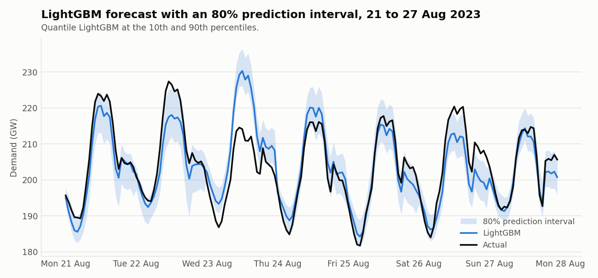

# India day-ahead electricity demand forecasting

Day-ahead **hourly** forecasts of India's national electricity demand. Two naive baselines, a classical statistical model (Holt-Winters), Ridge regression and LightGBM are compared under a strict walk-forward evaluation on two held-out years, with prediction intervals, a validation-year hyper-parameter search, leakage tests and a walkthrough notebook.

**Result.** On the most recent test year (1 May 2023 to 30 Apr 2024, 8,784 hours) LightGBM reaches **1.70 % MAPE** (MAE 3.1 GW). That is 35 % lower MAE than repeating yesterday's value and 63 % lower than repeating last week's. On the year before (May 2022 to Apr 2023) it reaches 1.68 %.


Test year 2023-24 (MAPE is the mean absolute percentage error over all hours; "daily peak" scores the forecast of each day's maximum):

| Model | MAE (MW) | RMSE (MW) | MAPE (%) | Daily-peak MAPE (%) |
|---|---:|---:|---:|---:|
| **LightGBM** (lag, calendar and last-hours features) | **3,130** | **4,443** | **1.70** | **1.85** |
| LightGBM without the last-hours features | 3,378 | 4,735 | 1.85 | 1.86 |
| Ridge regression (basic features) | 3,752 | 5,156 | 2.06 | 2.02 |
| Naive: same hour yesterday | 4,846 | 6,596 | 2.67 | 2.53 |
| Holt-Winters (ETS), refitted daily | 7,342 | 9,780 | 3.98 | 4.74 |
| Naive: same hour last week | 8,450 | 11,051 | 4.69 | 4.58 |

MAPE on both test years (`results/metrics_all_folds.csv` has every metric):

| Model | 2022-23 | 2023-24 |
|---|---:|---:|
| LightGBM | 1.68 | 1.70 |
| LightGBM without last-hours features | 1.73 | 1.85 |
| Ridge | 1.96 | 2.06 |
| Naive: yesterday | 2.60 | 2.67 |
| Holt-Winters | 3.96 | 3.98 |
| Naive: last week | 4.30 | 4.69 |

In 2023-24 LightGBM beats the yesterday baseline in all 12 months and beats Ridge in 11 of 12. Its error is largest in April 2024 (3.09 %) and May 2023 (2.16 %). Public holidays are harder than ordinary days (2.69 % against 1.65 % MAPE). Average bias is small, about +0.15 GW. The causes of the worst days have not been investigated, and the model has no weather input.


## The forecasting task

A forecast is issued at **00:00 of day D** and must predict all 24 hours of day D, using only data up to 23:00 of day D-1. This matches how a day-ahead schedule is produced, and it constrains the features:

* Same hour 1, 2, 3, 7 and 14 days earlier (lags of 24 hours or more).
* Daily summaries (mean, max, min) of day D-1 and a 7-day mean.
* The **last observed hours**: the 23:00 value and the 18:00 to 23:00 mean of day D-1, each relative to the same hours a week earlier. These carry the most recent momentum, and the model combines them with the hour of day to know how far ahead it is forecasting.
* Calendar features: hour, weekday, month, day of year (sine and cosine), and Indian public holidays (today, yesterday, and the same day last week).
* Lags of 1 to 23 hours are **not** used, because at midnight the value one hour before 05:00 is not yet known.

Demand grows about 5 % a year and tree models cannot extrapolate beyond the range they were trained on. So the ML models predict the **ratio** `demand / same hour last week` and multiply back, and every demand-level feature is expressed as a ratio too.



## Evaluation protocol

* **Two test folds:** May 2022 to Apr 2023 and May 2023 to Apr 2024. Nothing in them is used for training or for choosing settings.
* **Walk-forward:** Ridge and LightGBM are retrained at the start of every month on all data before that month (expanding window), then forecast each day of that month.
* **Hyper-parameter search** (`scripts/tune.py`): 12 LightGBM settings are scored on a separate **validation year, May 2021 to Apr 2022**, which lies entirely before both test folds. Candidates are retrained quarterly and ranked by MAE. The selected setting (15 leaves, minimum 50 samples per leaf, learning rate 0.06, 250 trees) is only slightly better than the others: best and worst differ by 2.9 % in MAE, so tuning matters little here (`results/tuning.csv`).
* **Holt-Winters:** refitted every day on the previous 42 days, additive damped trend and one 168-hour (daily plus weekly) seasonal pattern. Its window length was not tuned.
* **COVID-19:** rows from 25 Mar to 30 Jun 2020 are excluded from training, because demand then did not behave normally. This is a judgement call, and its effect has not been measured.
* **Leakage tests** (`tests/`): changing every value from day D onward must not change day D's features, and corrupting the later part of a test window must not change forecasts for earlier hours.

## Error by hour of day


Holt-Winters beats LightGBM only at 00:00 and 01:00, the hours nearest the last observation. The last-hours features were added for exactly this reason: they cut LightGBM's error at midnight from 1.63 % to 1.07 %.

## Prediction intervals



Quantile LightGBM at the 10th and 90th percentiles gives an 80 % interval about 7 to 8 GW wide (roughly 4.2 to 4.4 % of demand). It is **too narrow**: it contains only 70.0 % (2022-23) and 71.2 % (2023-24) of the actual values instead of 80 %. This is common when demand keeps shifting upward from year to year. Calibrating the interval, for example with conformal prediction, is the obvious fix and is not done here (`results/interval_metrics.csv`).

## The data


Hourly national demand in MW, 1 Jan 2019 to 30 Apr 2024 (46,728 hours, no gaps or duplicates, verified on load). It is read from `study1_hourly.csv` in the public repository [HalcyonVector/Grid-Sentinel](https://github.com/HalcyonVector/Grid-Sentinel), licensed CC BY-SA 4.0. According to that repository's documentation, the hourly load series comes from an hourly-load dataset on Kaggle and is joined to features scraped from the daily Power System Position reports published by Grid-India (NLDC). The hourly series could not be traced to a primary Grid-India file, so treat its provenance as second-hand. Its national column equals the sum of its five regional columns to within rounding.

The CSV is **not committed** here, because of its size and licence. The scripts download it to `data/raw/` on first run.

## Reproduce

```bash
python -m venv .venv && source .venv/bin/activate    # Windows: .venv\Scripts\activate
pip install -r requirements.txt && pip install -e .
python scripts/tune.py               # validation-year search (about 1 to 2 minutes), writes results/best_params.json
python scripts/run_experiment.py     # both test folds (about 7 minutes), writes results/
python scripts/make_figures.py       # redraws the figures
pytest                               # 18 tests
```

`notebooks/walkthrough.ipynb` explains the data, the setup and the results, and needs the `results/` files above. Install `jupyter` to rerun it.

Outputs in `results/`: `metrics.csv` (latest fold), `metrics_all_folds.csv`, `interval_metrics.csv`, `tuning.csv`, `best_params.json`, `predictions.csv` and `predictions_all_folds.csv` (actual and every model's forecast per hour), `mape_by_hour.csv`, `mape_by_month.csv`.

## Layout

```
src/demand_forecast/   data.py  features.py  models.py  evaluate.py  tuning.py  experiment.py
scripts/               tune.py  run_experiment.py  make_figures.py
notebooks/             walkthrough.ipynb
tests/                 leakage, metric, data-validation, tuning and backtest tests
results/               metrics, predictions, figures
.github/workflows/     tests.yml (runs pytest on every push)
```

## Limitations

* Two test years of national data, so the ranking could differ in another period, region or grid.
* No weather, temperature or economic indicators. Demand at national level is strongly weather-driven.
* Prediction intervals are too narrow (see above).
* National totals only. A regional or state-level model would be more useful for grid operators.
* The hourly data ends in April 2024, so the project says nothing about the most recent period.
* Holt-Winters uses one untuned window length, so its result is a modest baseline and not a tuned statistical benchmark.
* The hourly series is a second-hand copy of Grid-India data.

## Next steps

Add temperature as a feature, calibrate the prediction intervals, extend to regional demand, and backtest on more years as new data becomes available.

## Licence

Code: MIT (see `LICENSE`). The data keeps its own CC BY-SA 4.0 licence.
