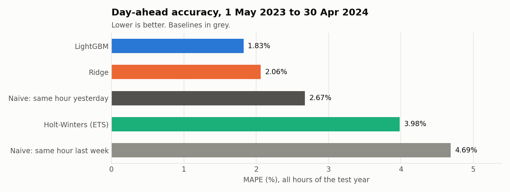
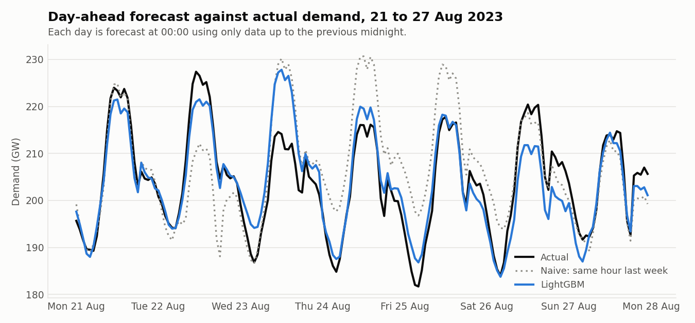
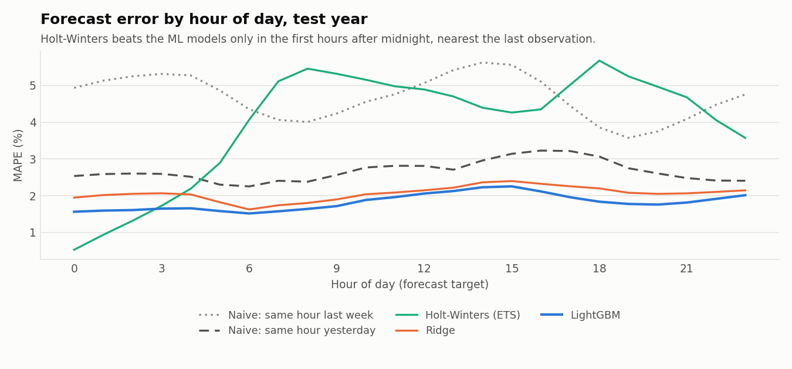
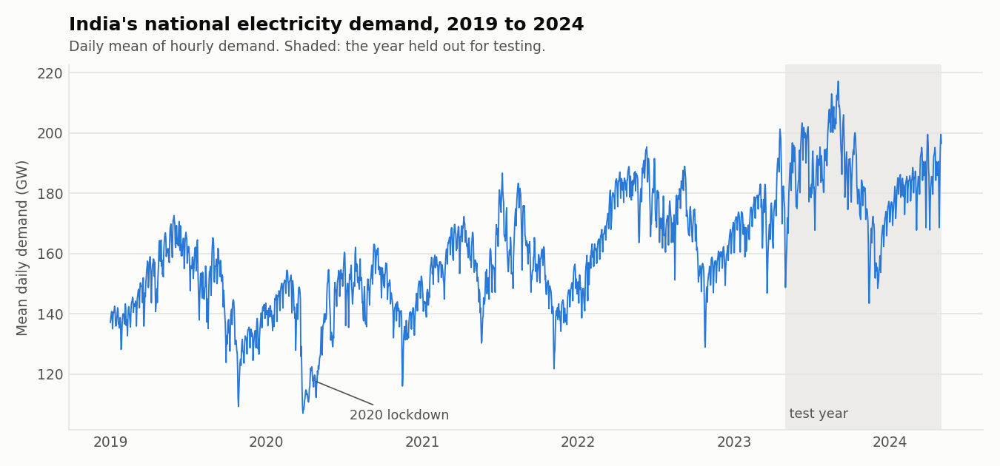

# India day-ahead electricity demand forecasting

Day-ahead **hourly** forecasts of India's national electricity demand, comparing two simple baselines, a classical statistical model (Holt-Winters) and two machine-learning models (Ridge regression and LightGBM) under a strict walk-forward evaluation.

**Result.** Over a held-out year (1 May 2023 to 30 Apr 2024, 8,784 hours) the LightGBM model reaches **1.83 % MAPE** (MAE 3.3 GW). That is 31 % lower MAE than repeating yesterday's value and 61 % lower than repeating last week's.



| Model | MAE (MW) | RMSE (MW) | MAPE (%) | Daily-peak MAPE (%) |
|---|---:|---:|---:|---:|
| **LightGBM** (gradient boosting on lag and calendar features) | **3,329** | **4,695** | **1.83** | **1.86** |
| Ridge regression (same features) | 3,752 | 5,156 | 2.06 | 2.02 |
| Naive: same hour yesterday | 4,846 | 6,596 | 2.67 | 2.53 |
| Holt-Winters (ETS), refitted daily | 7,342 | 9,780 | 3.98 | 4.74 |
| Naive: same hour last week | 8,450 | 11,051 | 4.69 | 4.58 |

LightGBM beats yesterday's-value baseline in 11 of the 12 test months and beats Ridge in 11 of 12. Its error is largest in May 2023 (2.40 %) and April 2024 (3.62 %). The model has no weather input, so heat-driven swings may explain part of this, but that has not been tested.



## The forecasting task

A forecast is issued at **00:00 of day D** and must predict all 24 hours of day D, using only data up to 23:00 of day D-1. This matches how a day-ahead schedule is produced, and it constrains the features:

* Lags of 24 hours or more are allowed (same hour 1, 2, 3, 7 and 14 days earlier).
* Daily summaries (mean, max, min) of day D-1 and a 7-day mean are allowed.
* Lags of 1 to 23 hours are **not** used, since at midnight the value one hour before 05:00 is not yet known.
* Calendar features: hour, weekday, month, day of year (sine and cosine), and Indian public holidays (today, yesterday and the same day last week).

Demand grows about 5 % a year, and tree models cannot extrapolate beyond the range they were trained on. So the ML models predict the **ratio** `demand / same hour last week` and multiply back. All demand-level features are expressed as ratios too, which makes them unit-free.

## Evaluation protocol

* **Test period:** 1 May 2023 to 30 Apr 2024. Nothing in it is used for training or for choosing settings.
* **Walk-forward:** Ridge and LightGBM are retrained at the start of every month on all data before that month (expanding window), then forecast each day of that month.
* **Holt-Winters:** refitted every day on the previous 42 days, additive damped trend and one 168-hour (daily plus weekly) seasonal pattern.
* **COVID-19:** rows from 25 Mar to 30 Jun 2020 are excluded from training, because demand then did not behave normally. This is a judgement call, and its effect has not been measured.
* **Hyper-parameters** are fixed a priori and not tuned. Tuning on a separate validation year would be a sensible next step.
* **Leakage tests** (`tests/`): changing every value from day D onward must not change day D's features, and corrupting the later part of the test window must not change forecasts for earlier hours.

## Error by hour of day



Holt-Winters beats the ML models only in the first hours after midnight, because it extrapolates directly from the last observed hour. The ML models cannot use that information by design. A hybrid that feeds the last observed hours into the early-morning forecast is an obvious improvement.

## The data



Hourly national demand in MW, 1 Jan 2019 to 30 Apr 2024 (46,728 hours, no gaps or duplicates, verified on load). It is read from `study1_hourly.csv` in the public repository [HalcyonVector/Grid-Sentinel](https://github.com/HalcyonVector/Grid-Sentinel), licensed CC BY-SA 4.0. According to that repository's documentation, the hourly load series comes from an hourly-load dataset on Kaggle and is joined to features scraped from the daily Power System Position reports published by Grid-India (NLDC). The hourly series could not be traced to a primary Grid-India file, so treat its provenance as second-hand. Its national column equals the sum of its five regional columns to within rounding.

The CSV is **not committed** here, because of its size and licence. `scripts/run_experiment.py` downloads it to `data/raw/` on first run.

## Reproduce

```bash
python -m venv .venv && source .venv/bin/activate    # Windows: .venv\Scripts\activate
pip install -r requirements.txt && pip install -e .
python scripts/run_experiment.py     # downloads data, runs the backtest (about 2 minutes), writes results/
python scripts/make_figures.py       # redraws the figures
pytest                               # 14 tests
```

Outputs: `results/metrics.csv`, `results/predictions.csv` (actual and every model's forecast per hour), `results/mape_by_hour.csv`, `results/mape_by_month.csv`.

## Layout

```
src/demand_forecast/   data.py  features.py  models.py  evaluate.py  experiment.py
scripts/               run_experiment.py  make_figures.py
tests/                 leakage, metric, data-validation and backtest tests
results/               metrics, predictions, figures
```

## Limitations

* One test year, so the ranking could differ in another year. Multi-year backtests would be stronger evidence.
* No weather, no temperature and no economic indicators. Demand at national level is strongly weather-driven.
* Point forecasts only, with no prediction intervals.
* National totals only. A regional or state-level model would be more useful for grid operators.
* Hourly data ends in April 2024, so the project says nothing about the most recent period.
* Holt-Winters uses a single window length that was not tuned, so its result is a modest baseline and not a tuned statistical benchmark.

## Next steps

Add temperature as a feature, add prediction intervals (quantile LightGBM), use the last observed hours in the early-morning forecast, tune hyper-parameters on a separate validation year, and test on several years.

## Licence

Code: MIT (see `LICENSE`). The data keeps its own CC BY-SA 4.0 licence.
